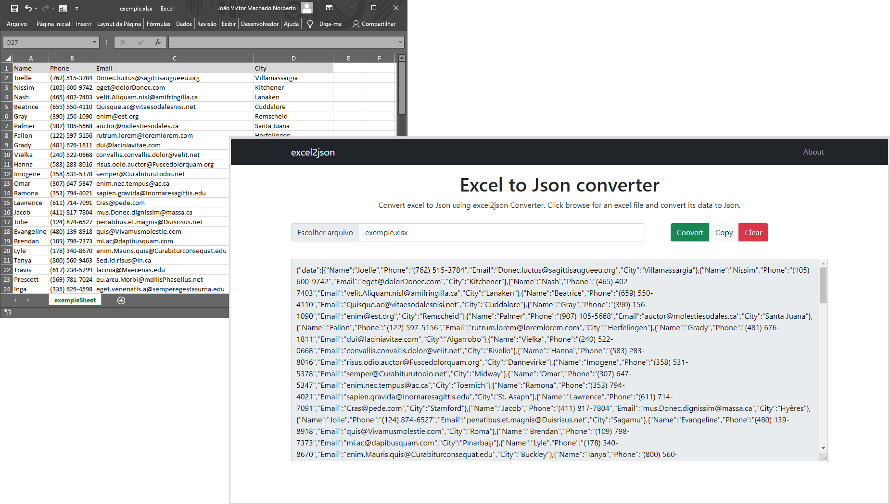

# excel2json

<h4>Uma Ferramenta online para converter uma planilha em Excel para JSON</h4>

Acesse: <a href="https://excel2json-app.vercel.app/">excel2json</a>

  

## Sobre o projeto

Projeto pessoal em ReactJS e Node.js

## Tecnologias e bibliotecas utilizadas

### Front-end

<a href="https://pt-br.reactjs.org/" target="_blank">- ReactJS</a>

<a href="https://styled-components.com/" target="_blank">- Styled Components</a>

<a href="https://react-bootstrap.github.io/" target="_blank">- React Bootstrap</a>

<a href="https://github.com/axios/axios" target="_blank">- Axios</a>

Deploy na <a href="https://vercel.com/" target="_blank">Vercel</a>

### Back-end

<a href="https://nodejs.org/en/" target="_blank">- Node.js</a>

<a href="https://www.npmjs.com/package/formidable" target="_blank">- Formidable</a>

<a href="https://www.npmjs.com/package/xlsx" target="_blank">- xlsx (SheetJS)</a>

<a href="https://expressjs.com/pt-br/" target="_blank">- Express</a>

Deploy na <a href="https://vercel.com/" target="_blank">Vercel</a>

